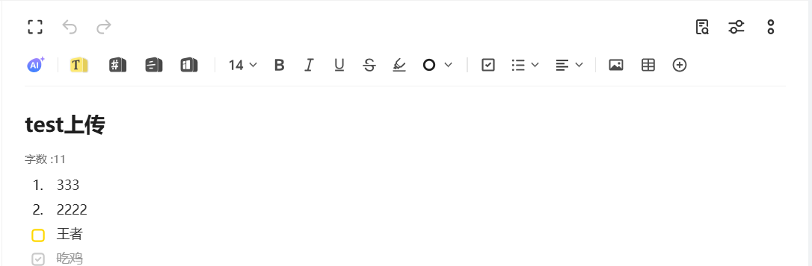
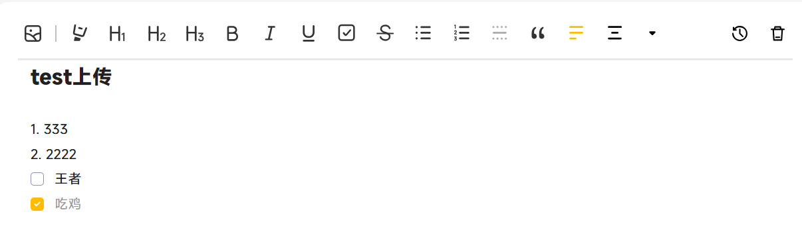

### 网页备份和手机备份区别
1. 网页备份不支持备份所有，所以用到export.js脚本，模拟点击网页上的导出
2. 网页备份成txt可以区分笔记是否存在标题，区分待办事项
3. 手机备份支持全部备份，备份的txt可以识别笔记修改时间。

### 使用教程
1. 先用老哥的脚本把所有笔记备份成txt文件格式，保存在一个空文件夹内
2. 老哥的脚本备份的txt，第一行是否为空可以判断原笔记是否存在标题，前两行没用所以在代码中将前两行
3. 自己获取小米官网的cookie
4. 修改备份文件所在路径
5. 执行main.py

### 问题
1. 笔记中的图片录音不会上传
2. 只能传输基本的文本格式

### 实现效果

上图vivo

上传到小米
